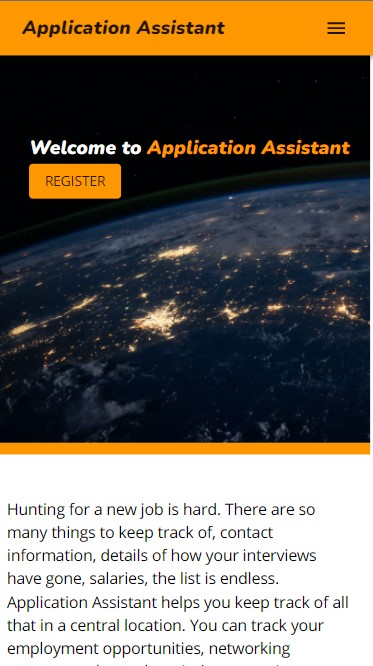
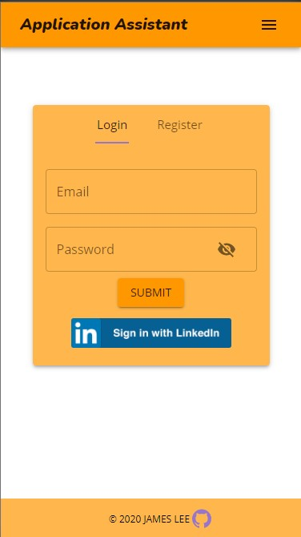
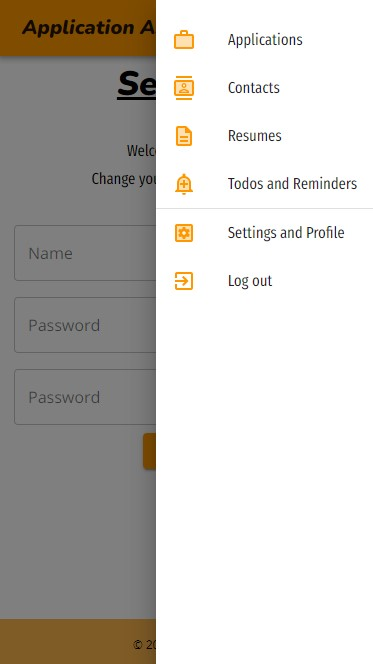
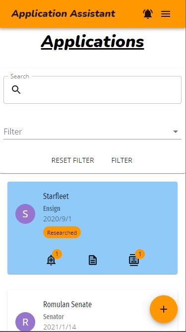
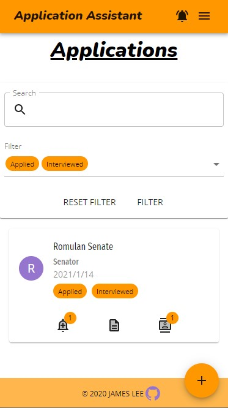
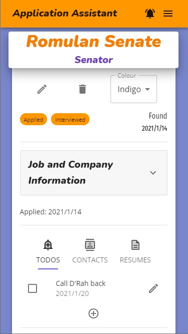
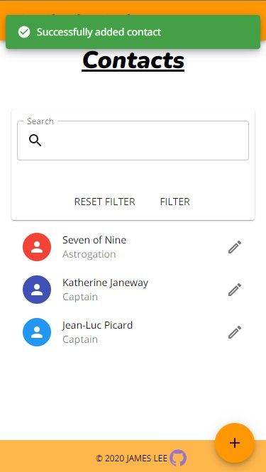
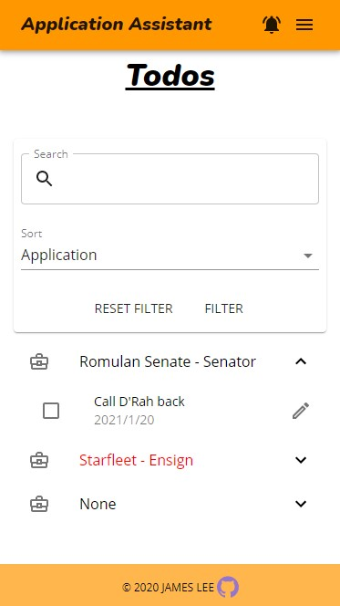

# Application Assistant

- [Description](#description)
- [Core Features and Walkthrough](#Core-Features-and-Walkthrough) 
- [Technologies](#Core-Technologies-and-Hosting) 
- [Credit](#credits) 

## Description

Application Assistant is a web application for tracking the details of your job searching journey.  In a job hunt there are lots of things to keep track of, usually relegated to a dry spreadsheet somewhere.  Application Assistant collects and displays the data to help make your journey easier, suggesting next steps and leveraging the data to show areas to improve in.  Networking contacts, todos and next step reminders, company background information, and information about each step with a posting from initial application to a final interview and offer.  I created Application Assistant to help make what can be a frustrating process just a little friendlier.

[Use Application Assistant, hosted by Heroku](https://applicationassistant.herokuapp.com)

## Core Features and Walkthrough

### Landing Page

### Login and Registration

User login or initial registration is accomplished on the entry page, either using a username/password pair, or with LinkedIn integration.

### Navigation

Navigation through Application Assistant on mobile is done through the side nav, which is swipable on touch devices; and through a horizontal navbar on desktop or otherwise wide viewport sozies.

### Applications Page

The heart of Assistant is the applications page, which is a broad overview of each position and a few tags to at a glance show you where you're at in the process.  The page is searchable and filterable.

Creating a new application, done through the floating addition button, brings the user to the new application page.  It gather data starting with the basics of a post and drilling down into details.  Todos can be added that will also populate the global Todos page, as can contacts and saved resume versions.

Once created, an application page looks like this.  The colour is selectable, and adding details such as a date of interview will automatically apply tags to the main applications view.

### Contacts Page

The Contacts page gathers the contacts either added independently or associated with a particular application.  The page is searchable and filterable, and each contact can be individually viewed or edited.

### Todos and Reminders Page

The Todos page collects todos from each application, as well as those created separately.  They can be edited, marked complete, and deleted from this view.  The list is searchable, sortable, and filterable.  The page sort can organize by due date, application association, et cetera.  Check here to see if you have any next steps you need to proceed with, negating the need to check each application individually.

### Other Features

The Resumes page collects tailored versions of your resume.  Creating a resume for a front end position, or highlighting your GraphQL experience, save them here to easily choose the proper version to send to a potential employer.

Settings collects all of the configurables, and enables the user to change personal details and password.

## Core Technologies and Hosting

 - ReactJS ([Documentation](https://reactjs.org/docs/getting-started.html)), Material UI ([Documentation](https://material-ui.com/))
 - MongoDB ([Documentation](https://docs.mongodb.com/)) and Mongoose ([Documentation](https://mongoosejs.com/docs/api.html))
 - Express ([Documentation](https://expressjs.com/en/api.html)), Bcrypt ([Documentation](https://www.npmjs.com/package/bcrypt)), Passport ([Documentation](https://www.npmjs.com/package/passport))
 - Node ([Documentation](https://nodejs.org/en/docs/))
 - Heroku web hosting
 - Version control through GIT and GitHub
 - Database hosted through MongoDB Atlas

## Credits

Created 2020 by James Lee

[James Lee's personal page](https://jamesdeveloping.ca)